

   
  
   
  <h1>동화책 제작소 YummyYagi</h1>
   

## 목차

1. [**웹 서비스 소개**](#1)
2. [**기술 스택**](#2)
3. [**주요 기능**](#3)
4. [**프로젝트 구성도**](#4)
5. [**데모 영상**](#5)
6. [**개발 팀 소개**](#6)
7. [**개발 기간 및 일정**](#7)
8. [**구글 애널리틱스 통계**](#8)

 

## 💁 웹 서비스 소개

**YummyYagi(맛있는 이야기) 동화를 만들고 세계 동화를 느끼다.**

>YummyYagi는 어린이들의 상상력과 다양한 문화 탐험을 촉진하는 온라인 플랫폼입니다. 부모와 함께 다양한 동화를 만들고 읽을 수 있으며, 다양한 언어로 번역하여 제공됩니다. 이를 통해 아이들과 부모는 세계 각지의 이야기를 탐험하며 놀이와 학습을 통해 함께 성장할 수 있습니다.
>
> <a href="https://www.yummyyagi.com/">YummyYagi 방문하기</a>

  
📌 기획 계기

  

    <ul>
      <li>
        YummyYagi는 어린이들이 디지털 미디어에 노출되는 것에 우려를 가지고, 상상력 및 창의력을 키울 수 있는 도구를 제공하여 아이들이 더 긍정적이고 다양한 경험을 쌓을 수 있도록 돕고자 합니다. 
      </li>
    </ul>
  

  
👩‍👩‍👧‍👧 타겟층

  

    <ul>
      <li>전세계 어린이와 그들의 가족</li>
    </ul>
  

  
💫가설

  

    <ul>
      <li>
      YummyYagi의 다국어 이야기 활용가설은, 어린이들이 다양한 언어와 문화를 탐험하며 글로벌 시각과 상호 이해를 촉진하고, 계속 확장되는 다국어 콘텐츠를 통해 서비스 이용자를 늘리며 어린이 언어 학습을 도울 것으로 기대됩니다. 또한, 어린이들이 세계 문화를 탐험하며 문화 간 연결과 공감을 촉진할 것으로 예측됩니다.
      </li>
    </ul>
  

  
👍 기대 효과

  

    <ul>
      <li>
        YummyYagi의 기대효과는 다양한 언어와 문화를 다루는 다국어 콘텐츠를 통해 글로벌 시장으로의 확장을 이루고, 다양한 국가의 사용자를 유치하는 것입니다. 또한, 다국어 동화와 창작 기능을 통해 성장하는 사용자 커뮤니티를 형성하고 유지하며, 긍정적인 사용자 경험을 제공하여 재방문률을 높일 것으로 예상됩니다. 이러한 선순환 효과는 더 많은 사용자와 콘텐츠 창작자가 참여하면서 플랫폼을 풍요롭게 만들어 다양성을 증진시키고 사용자 유치에 기여할 것입니다.
      </li>
    </ul>
  

    
💡 기획 아이디어 모음

    

        <ol>
            <li>
                [V]  [동화 창작 도구] : 키워드를 통해 챗 GPT에게 동화를 만들어달라고 하는 기능
            </li>
            <li>
                [V]  [동화 주제 검열] : GPT의 답변을 보여주고 이미지 생성 선택이 가능하게 / 그래도 생성하려는 사용자 처리는 나중에 생각. (단어에서 폭력성을 검증하는 라이브러리 활용)
            </li>
            <li>
                [V]  [동화 이야기 시각화] : 생성된 동화 내용별 이미지 생성
            </li>
            <li>
                [V]  [동화 게시 및 공유 기능] : 챗 GPT에게 받은 동화를 게시글로 등록하고  원하면 공유까지
            </li>
            <li>
                [V]  [동화 카테고리] : 나라별 / 인기글
            </li>
            <li>
                [V]  [댓글 / 사용자 리뷰] : 동화에 대한 리뷰 및 평가 기능
            </li>
            <li>
                [V]  [북마크] : 또 읽고 싶은 동화 북마크 기능
            </li>
            <li>
                [V]  [소셜 로그인] : 가입 및 로그인을 소셜 로그인으로 가능
            </li>
            <li>
                [V]  [동화 좋아요 순위] : 사용자 평가 및 좋아요 수를 기반으로 순위를 매기는 기능
            </li>
            <li>
                [V]  [회원가입시 이메일 인증] : 이메일 인증을 완료한 사용자만 로그인 가능
            </li>
            <li>
                [V]  [게시글(동화) 싫어요 기능] : 생성된 게시글(동화) 자정작용을 위한 기능.
                  -> 생성된 게시글이 일정 이상의 싫어요 갯수를 받으면 사용자들에게서 해당 게시글이 보여지지 않게 설정. 이후 이런 게시글을 관리자가 따로 모아보는 페이지에서 관리 가능. 실제로 악의적인 글이면 삭제시킬 수 있고, 그렇지 않으면 다시 사용자들에게 보여질 수 있게 해주는 기능.
            </li>
            <li>
                [V]  [고객센터] : 페이지를 이용하는 사용자들의 피드백을 받는 기능
            </li>
            <li>
                [V]  [최근 본 목록] : 최근 조회한 게시물의 목록을 볼 수 있는 기능
            </li>
            

            <li>
                [ ]  [동화 컨텐츠 제작 제한] : 하루 동화 제작 갯수 제한
            </li>
            <li>
                [ ]  [다국어 번역] : 게시글 목록에는 국가 상관 없이 동화들이 올라오는데 내가 주 언어로 선택한 언어로 자동 번역되서 보임
            </li>
            <li>
                [ ]  [개인 동화 컬렉션] : 직접 만든 동화들을 하나의 책으로 편집해서 출판하는 기능
            </li>
            <li>
                [ ]  [관심 동화 알림 서비스] : 사용자가 관심 키워드를 선택하여 알림 받는 기능
            </li>
            <li>
                [ ]  [동화 결말 선택지 제시] : 아이들이 동화의 결말을 선택할 수 있게 선택지 제시
            </li>
            <li>
                [ ]  [동화 추천 알고리즘] : 사용자에게 선호할만한 동화 추천 기능
            </li>
            <li>
                [ ]  [동화 음성 낭독] : 동화를 내가 원하는 언어로 번역해서 보여주고 음성도 내가 원하는 언어로 동화를 읽어줌.
            </li>
            <li>
                [ ]  [책갈피] : 읽은 곳까지 체크 해 놓는 기능
            </li>
            <li>
                [ ]  [동화 컨텐츠 결제 옵션] : 실제 시중에 유통되는 동화들도 볼 수 있음. 이것은 작가와 계약을 맺어서 공급하는 방식으로 해당 동화들은 결제를 통해 ebook과 음성 파일을 다운 받을 수 있음.
            </li>
            <li>
                [ ]  [영상 업로드] : 동화 제작이 아닌 직접 낭독하는 영상 업로드 → 자막 & 실시간 번역 음성 송출
            </li>
            <li>
                [ ]  [글 작성시 꾸미기] : 글씨 폰트/크기/색 등을 변경 가능하도록 하는 기능
            </li>
            <li>
                [ ]  [동화 공모전 및 이벤트] : 정기적으로 동화 공모전을 개최하고, 우수 작품에 상금 수여
            </li>
            <li>
                [ ]  [유료 동화 음성 낭독] : 동화를 읽어주는 목소리를 연예인 등으로 선택 가능
            </li>
            <li>
                [ ]  [고객센터 업그레이드] : QnA에 대한 답변을 해주는 기능, ‘자주 묻는 질문’ 페이지 작성
            </li>
        </ol>
    

 

## 🛠️ 기술 스택

### **Back-end**
|  |  | 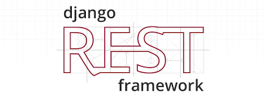 |  | 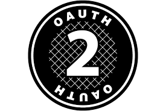 |
| :----------------------------: | :----------------------------: | :----------------------------: | :----------------------------: | :----------------------------: |
|            Python            |            Django            |            Django Rest Framework            |            Celery            |            OAuth2            |

### **Front-end**
|  |  |  |  |  |
| :----------------------------: | :----------------------------: | :----------------------------: | :----------------------------: | :----------------------------: |
|            HTML5            |            CSS3            |            Javascript            |            Bootstrap            |            JQuery            |

### **AI**
| 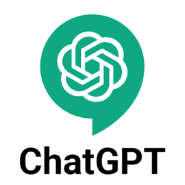 |  |  |  |
| :----------------------------: | :----------------------------: | :----------------------------: | :----------------------------: |
|            ChatGPT API            |            DALL-E API            |            DeePL API            |            Perspective API            |

### **Dev-Ops**
|  | 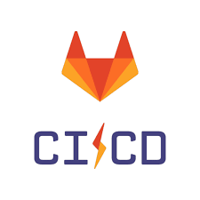 |  |  |  |
| :----------------------------: | :----------------------------: | :----------------------------: | :----------------------------: | :----------------------------: |
|            Git            |            GitLab CI/CD            |            Docker            |            Nginx            |            Aws            |

### **Version-Control**
|  |  |
| :----------------------------: | :----------------------------: |
|            Git            |            Github            |

### **Database**
|  |
| :----------------------------: |
|            PostgreSQL            |

 

## 💡 주요 기능
|            기능             | 
내용
  
| :-------------------------: | :------------------------------------------------------------------------------------------- |
|   사용자 인증 및 회원가입   | 사용자는 필수로 이메일, 비밀번호, 닉네임, 국가를 입력하여 회원가입하고 이메일 인증을 완료한 후 로그인이 가능합니다.  또는 소셜 로그인으로도 회원가입 및 로그인이 가능합니다. |
|   동화 창작 도구   | 사용자는 원하는 언어를 선택하고 주제를 입력하여 [ 전송 ] 버튼을 누르면 검열을 거친 후 통과하면 Chat GPT가 동화를 생성해줍니다. |
|   부적절한 키워드 검열   | 사용자가 입력한 주제에서 동화에 적합하지 않은 부적절한 키워드를 검열하여 Chat GPT에게 전송되는 것을 제어합니다. 또한 Chat GPT가 생성한 동화 내용에서도 검열을 거쳐 사용자에게 전달됩니다. |
|   페이지 이미지 생성   | 사용자는 생성된 동화 페이지 중 원하는 페이지의 이미지를 생성할 수 있습니다. 이미지 퀄리티는 사용자가 사용하는 티켓에 의해 조절됩니다. |
| 동화책 출판 전 내용 수정 및 임시 저장 | 동화를 생성하는 중, 사용자가 자리를 비우거나 원치 않게 창이 종료되었을 때, 사용자는 가장 최근에 생성하던 동화를 불러와 동화 생성 작업을 지속하는 것이 가능합니다.  |
|   동화책 출판하기   | 사용자는 키워드를 통해 생성된 동화 내용과 그림을 확인 후 해당 동화가 마음에 들 경우 동화를 출판하여 홈페이지에 게시하는 것이 가능합니다.  |
|   동화 내용 6개 국어로 번역하여 보기    | 사용자는 상세 페이지에서 Chat GPT가 생성해준 (영어) 동화 내용을 [언어 선택 - 번역된 스토리 보기] 기능을 통해 원하는 언어로 번역된 내용을 볼 수 있습니다. |
|   북마크 기능을 통한 서재 만들기   | 마음에 드는 동화를 북마크하여 추후 마이페이지 내 서재를 통해 언제든 다시 열람하는 것이 가능합니다. |
|   댓글을 통한 리뷰 공유   | 작성된 동화를 공유하고 댓글을 통해 서로 리뷰를 공유하는 것이 가능합니다. |
|   좋아요를 통한 동화 평가   | 좋아요를 통해 간단하고 직관적인 방법으로 동화를 평가할 수 있고, 다른 사용자들이 해당 정보를 참고하여 동화를 선택할 수 있도록 도울 수 있습니다. 메인 페이지에서 인기순 Top8으로 볼 수 있습니다. |
|   게시글 싫어요 기능   | 생성된 게시글(동화) 자정 작용을 위한 기능입니다.  생성된 게시글이 일정 개수 이상의 싫어요를 받으면 사용자들에게서 해당 게시글이 노출되지 않습니다.  이후 이런 게시글을 관리자가 따로 모아보는 페이지에서 관리하는 것이 가능하고, 실제로 악의적인 글이면 삭제 시킬 수 있습니다. 관리자의 판단 하에 문제가 없는 글일 경우 다시 사용자들에게 보여질 수 있도록 설정하는 것이 가능합니다. |
|   결제 시스템   | 결제는 카카오페이와 토스페이가 지원되며, 사용자는 결제 시스템을 통해 티켓을 구매할 수 있습니다. 티켓은 동화책 이미지 생성에 사용됩니다. |
|   공유하기 기능   | 원하는 게시글(동화)을 공유할 수 있는 기능입니다. |
|   고객센터 기능   | 사용자들의 피드백을 받습니다. |

 

## 📂 프로젝트 구성도

| [🔗와이어프레임(Wireframe)](https://www.figma.com/file/lCqdjTypwGYEFBLiQgAzPT/%EC%99%100%EC%9D%B4%EC%96%B4-%ED%94%84%EB%A0%88%EC%9E%84?type=design&node-id=0-1&mode=design&t=QZYfl3ZzUwp35Zd3-0) |
| :------------------------------------------------------------: |
| 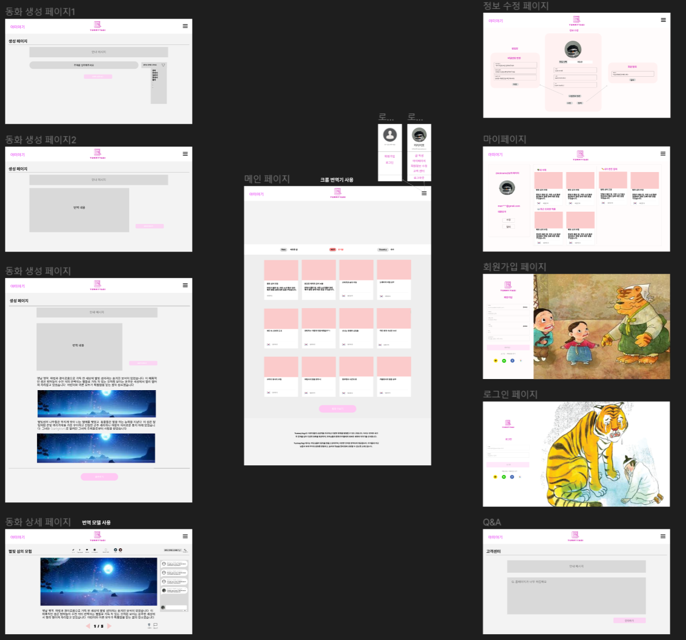 |

| 아키텍처(Architecture) |
| :------------------------------------------------------------: |
| 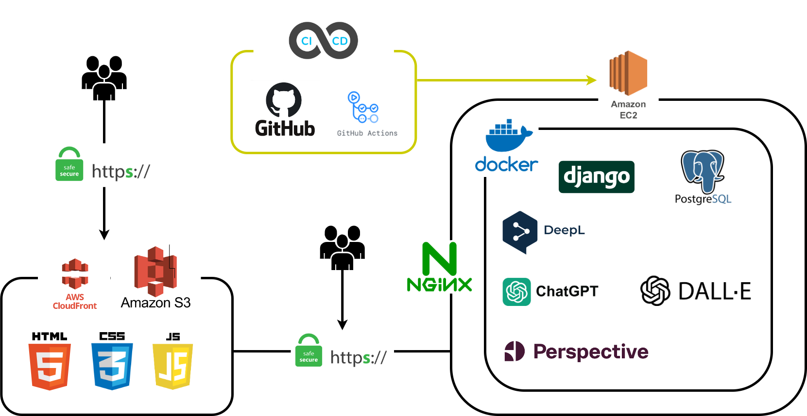 |

|  개체-관계 모델(ERD) |
| :------------------------------------------------------------: |
| 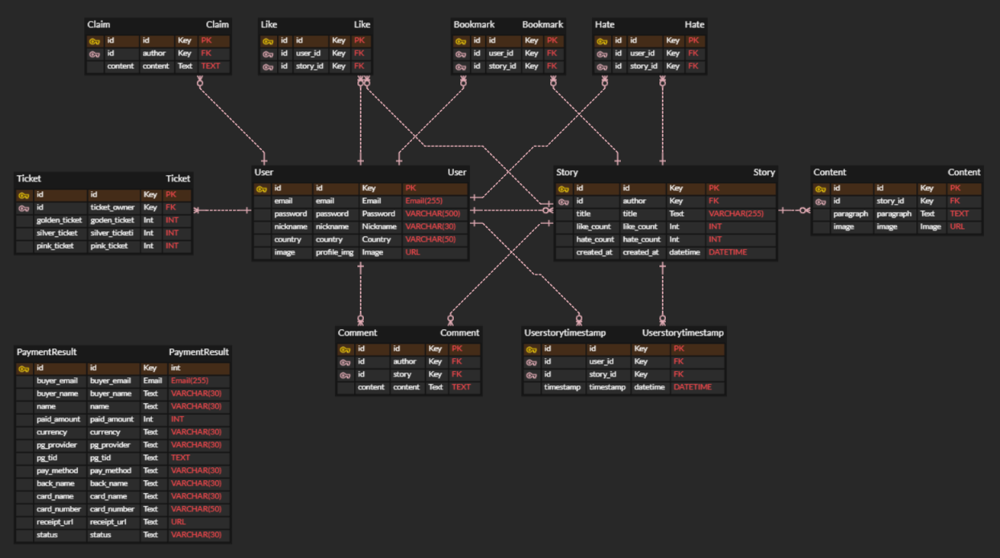 |

 

## 🖥️ 데모 영상

|                          메인 페이지                          |
| :-------------------------------------------------------------: |
|  |

|                         회원가입 페이지                         |
| :------------------------------------------------------------: |
|  |

|                        로그인 페이지                        |
| :--------------------------------------------------------: |
|  |

|                          동화책 제작 페이지                          |
| :-----------------------------------------------------------------: |
|  |

|                          상세 페이지                          |
| :-----------------------------------------------------------: |
|  |

|                        마이 페이지                        |
| :--------------------------------------------------------: |
|  |

|                          회원 정보 수정 페이지                          |
| :-------------------------------------------------------------------------: |
|  |

|                       고객센터 페이지                       |
| :-------------------------------------------------------: |
|  |

|                        티켓 결제 페이지                        |
| :-------------------------------------------------------------: |
|  |

 

## 👪 개발 팀 소개

<table>
    <tr>
        <td style="text-align:center;">
            이름
        </td>
        <td style="text-align:center;">
            Email
        </td>
        <td style="text-align:center;">
            Github
        </td>
        <td style="text-align:center;">
            Blog
        </td>
    </tr>
    <tr>
        <td style="text-align:center;">
                장현웅
        </td>
        <td style="text-align:center;">
                hyeonwoongjang01@gmail.com
        </td>
        <td style="text-align:center;">
            <a href="https://github.com/HyeonwoongJang">
                https://github.com/HyeonwoongJang
            </a>
        </td>
        <td style="text-align:center;">
            <a href="https://velog.io/@alex01">
                https://velog.io/@alex01
            </a>
        </td>
    </tr>
    <tr>
        <td style="text-align:center;">
                공혜진
        </td>
        <td style="text-align:center;">
                dusen380@gmail.com
        </td>
        <td style="text-align:center;">
            <a href="https://github.com/hjzheld">
                https://github.com/hjzheld
            </a>
        </td>
        <td style="text-align:center;">
            <a href="https://blog.naver.com/hj_zheld">
                https://blog.naver.com/hj_zheld
            </a>
        </td>
    </tr>
    <tr>
        <td style="text-align:center;">
                심명희
        </td>
        <td style="text-align:center;">
                mang1670@gmail.com
        </td>
        <td style="text-align:center;">
            <a href="https://github.com/myeonghee2">
                https://github.com/myeonghee2
            </a>
        </td>
        <td style="text-align:center;">
            <a href="https://blog.naver.com/mang160">
                https://blog.naver.com/mang160
            </a>
        </td>
    </tr>
    <tr>
        <td style="text-align:center;">
                양수홍
        </td>
        <td style="text-align:center;">
                igsh97@naver.com
        </td>
        <td style="text-align:center;">
            <a href="https://github.com/igsh97">
                https://github.com/igsh97
            </a>
        </td>
        <td style="text-align:center;">
            <a href="https://ysh-dev-dailylog.tistory.com/">
                https://ysh-dev-dailylog.tistory.com/
            </a>
        </td>
    </tr>
    <tr>
        <td style="text-align:center;">
                윤한기
        </td>
        <td style="text-align:center;">
                sevil08112@naver.com
        </td>
        <td style="text-align:center;">
            <a href="https://github.com/SEVIL-K">
                https://github.com/SEVIL-K
            </a>
        </td>
        <td style="text-align:center;">
            <a href="https://hgts.tistory.com/">
                https://hgts.tistory.com/
            </a>
        </td>
    </tr>
    <tr>
        <td style="text-align:center;">
                이기호
        </td>
        <td style="text-align:center;">
                leekh9997@naver.com
        </td>
        <td style="text-align:center;">
            <a href="https://github.com/gihohoho">
                https://github.com/gihohoho
            </a>
        </td>
        <td style="text-align:center;">
            <a href="https://hogi2.tistory.com/">
                https://hogi2.tistory.com/
            </a>
        </td>
    </tr>
</table>

 

## 📅 개발 기간 및 일정

### 개발 기간
2023-11-03 ~2023-12-06

| 주차  |                                               내용                                                |
| :---: | :-----------------------------------------------------------------------------------------------: |
| 1주차 |    기획안 확정 와이어프레임 작성  유저 플로우 & 프로세스 플로우 작성 아키텍처 설계 ERD 설계  API 설계   AI 파트 및 백엔드 MVP 구현   |
| 2주차 |    프론트엔드 구현  프론트엔드 & 백엔드 병합 CSS    |
| 3주차 |    AWS 배포 추가 기능 개발 에러 캐칭    |
| 4주차 |    유저 테스트 피드백 수용 에러 캐칭 추가 보수 작업    |
| 5주차 |    유저 테스트 피드백 수용 테스트 코드 작성   코드 리뷰 에러 캐칭 추가 보수 작업    |

 

## 📊 구글 애널리틱스 통계

> 서비스 기간 : 2023-11-28 ~2023-12-05 (7일)

### 페이지 및 화면

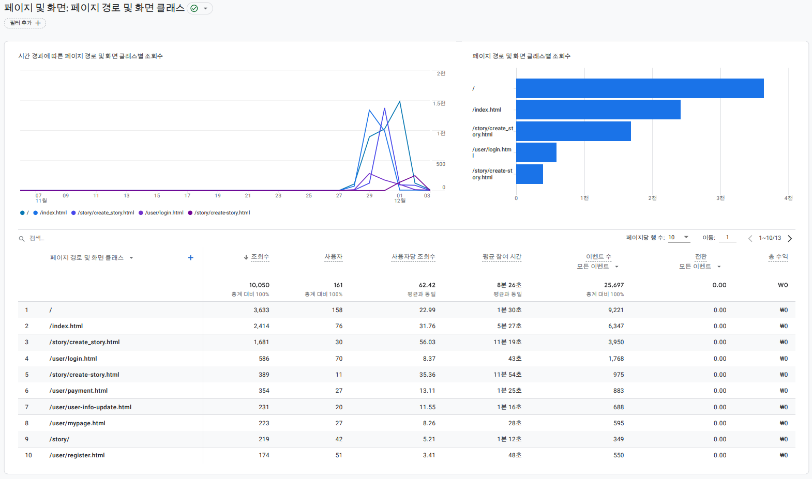

### 이벤트

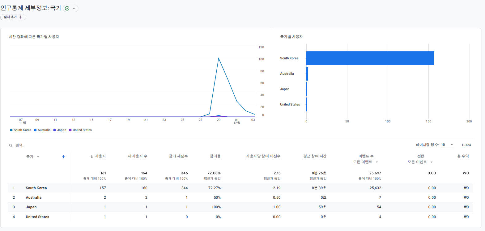

### 인구 통계 세부

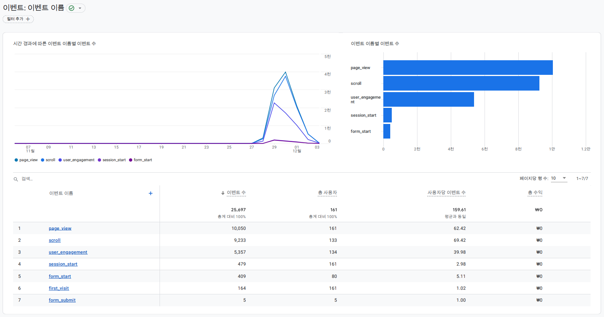

### 기술 세부 정보

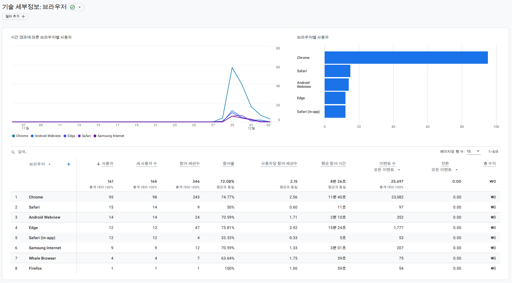
